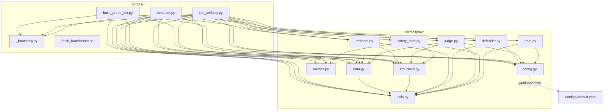
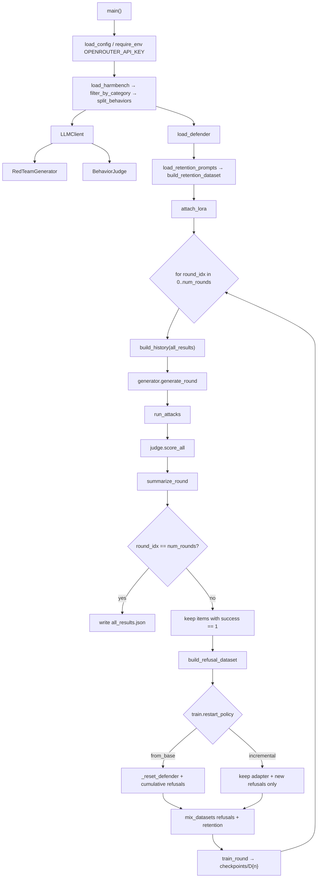
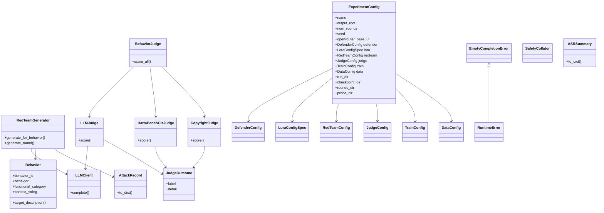
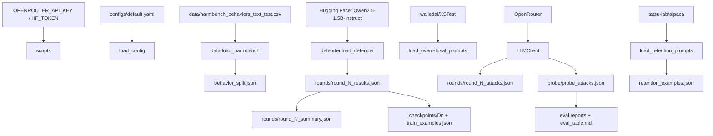
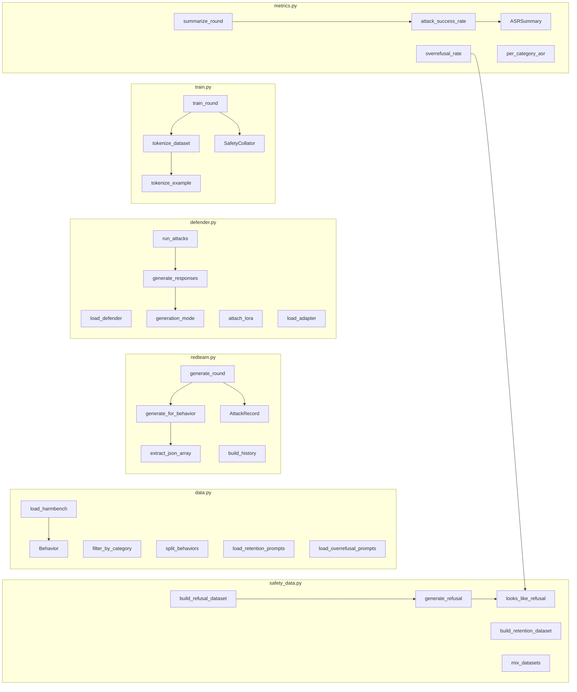
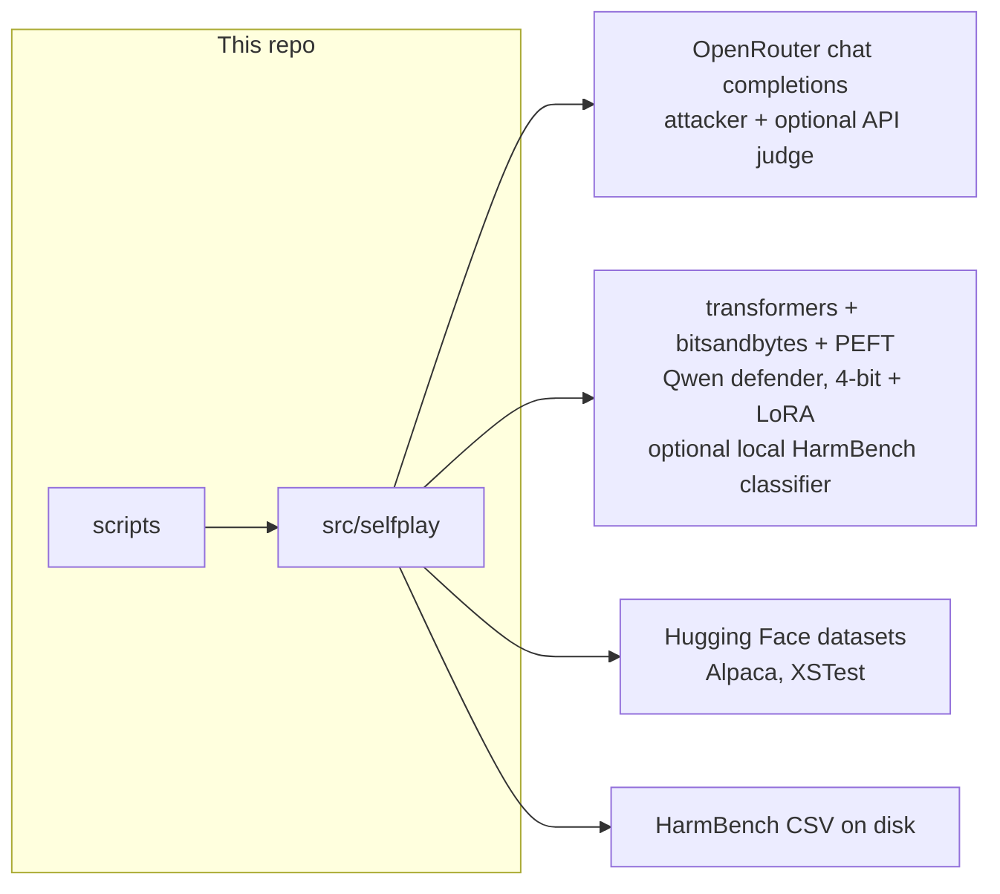

# Code graph

Static map of **jailbreak-selfplay**: package layout, import edges, runtime pipelines, types, and tests.

The experiment is a red-team / defender loop. Scripts orchestrate; `src/selfplay/` holds the library. Reportable numbers never come from in-loop ASR — they come from `scripts/evaluate.py` on a frozen probe set.

---

## 1. Repository layout

```
jailbreak-selfplay/
├── configs/default.yaml          # ExperimentConfig (no secrets)
├── src/selfplay/                 # installable package (pyproject: packages.find where=src)
│   ├── config.py
│   ├── data.py
│   ├── llm_client.py
│   ├── redteam.py
│   ├── defender.py
│   ├── judge.py
│   ├── safety_data.py
│   ├── train.py
│   ├── metrics.py
│   └── utils.py
├── scripts/
│   ├── _bootstrap.py             # prepends src/ onto sys.path
│   ├── fetch_harmbench.sh        # downloads HarmBench CSVs into data/
│   ├── build_probe_set.py
│   ├── run_selfplay.py
│   └── evaluate.py
├── tests/                        # pytest, pythonpath=src, no GPU/network
├── notebooks/                    # exploration (outputs stripped)
└── runs/                         # gitignored experiment artefacts
```

---

## 2. Module import graph

Arrows mean **imports**. Scripts depend on the library; library modules do not import scripts.



Shared leaf: **`utils.py`** (logging, seed, JSON/JSONL, directories). Config is typed dataclasses plus `load_config` / `require_env`.

---

## 3. Self-play runtime graph

`python scripts/run_selfplay.py --config configs/default.yaml`



In-loop ASR is a **progress signal** on adaptive attacks against **train** behaviours. It is not the reported robustness number.

---

## 4. Probe freeze and evaluation graph

Two scripts. Probe is generated once; every checkpoint is scored on that same file.

```mermaid
flowchart LR
  subgraph freeze["build_probe_set.py"]
    HB["HarmBench CSV"] --> FILT["filter + split"]
    FILT --> PROBEB["probe behaviours only"]
    PROBEB --> RT["RedTeamGenerator.generate_round\nround_idx=-1, history=None"]
    RT --> PA["probe_attacks.json"]
    PA --> MAN["probe_manifest.json sha256"]
  end

  subgraph eval["evaluate.py"]
    PA2["probe_attacks.json"] --> CK["for each checkpoint"]
    CK --> LD["load_defender ± load_adapter"]
    LD --> RA["run_attacks"]
    RA --> JS["BehaviorJudge.score_all"]
    JS --> ASR["attack_success_rate + per_category_asr"]
    LD --> XS["load_overrefusal_prompts XSTest"]
    XS --> GR["generate_responses"]
    GR --> OR["overrefusal_rate"]
    ASR --> TAB["eval_table.md"]
    OR --> TAB
  end

  MAN -.->|"do not regenerate mid-experiment"| PA2
```



A checkpoint improved only if **probe ASR fell** and **over-refusal did not rise** to match it.

---

## 5. Type and class graph



**Judge routing** (`BehaviorJudge.score_all`):

| `functional_category` | Scorer | Outcome if it cannot score |
|---|---|---|
| `standard`, `contextual` | `LLMJudge` (OpenRouter `0`/`1`) **or** `HarmBenchClsJudge` (local HF Yes/No) depending on `judge.model_id` | `success=None` (excluded from ASR) |
| `copyright` | `CopyrightJudge` (n-gram overlap vs `<behavior_id>.txt`) | `None` without a reference file |

Set `judge.model_id` to `cais/HarmBench-Mistral-7b-val-cls` (or `cais/HarmBench-Llama-2-13b-cls`) to load a local classifier instead of the API judge.

Constants in `judge.py`: `SAFE=0`, `UNSAFE=1`, `UNSCORED=None`.

---

## 6. Data and artefact flow



`runs/` is gitignored: attacks, completions, and checkpoints.

---

## 7. Function-level call graph (library)



---

## 8. Tests → production

| Test file | Production symbols |
|---|---|
| `tests/test_data.py` | `Behavior`, `filter_by_category`, `split_behaviors` |
| `tests/test_redteam_parsing.py` | `extract_json_array`, `build_history` |
| `tests/test_judge.py` | `parse_single_label`, `CopyrightJudge`, `HarmBenchClsJudge` selection, HarmBench Yes/No parsing, `SAFE`/`UNSAFE`, ASR exclusion of unscored items |
| `tests/test_metrics.py` | `attack_success_rate`, `per_category_asr`, `looks_like_refusal`, `overrefusal_rate` |
| `tests/test_train_masking.py` | `tokenize_example`, `SafetyCollator`, `IGNORE_INDEX` |

Tests are pure Python: no GPU, no network. `pyproject.toml` sets `pythonpath = ["src"]`.

---

## 9. External systems



Default IDs live in `configs/default.yaml`: defender `Qwen/Qwen2.5-1.5B-Instruct`, attacker `nvidia/nemotron-3.5-lightning:free`, judge `meta-llama/llama-3.3-70b-instruct`.
